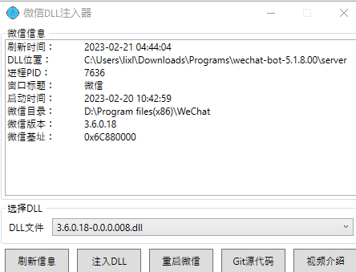

<h1 align="center">wechat_bot</h1>


使用基于 ChatGPT (非API-KEY调用) 、Stable Diffusion AI画图（本地部署） 与 官方微信hook接口 的 ChatGPT-3 / ChatGPT4
机器人。（本着开源想法，连Readme都是抄的）

下面是私聊的自我介绍：

"当前是关闭自动回复状态\n" \
"如需启用自动回复请输入：启用\n" \
"如需关闭自动回复请输入：关闭\n" \
"您可以直接发送文字给我，默认使用ChatGPT-4 没有上下文关联；\n" \
"如需要上下文，请在说话前增加g，增加t为生成图片\n" \
"连续问的问题太多，会因为微信本身策略限制并提示我：[发送消息过于频繁，可稍后再试]\n" \
"这样会造成我无法回复消息给您，甚至封号，所以请您不要连续提问太多问题，可以隔一段时间再试，谢谢。\n" \
"您也可以尝试自动搭建，地址https://github.com/flipturn14/wechat_bot\n" \
"如果感觉好用，请在github上点击一个star"

下面是入群新人会自动发言的消息：

"调用GPT对话请在文字前增加召唤字母\n" \
"可用功能为c/g/t\n" \
"c=ChatGPT-4 没有上下文关联\n" \
"g=ChatGPT-3 支持上下文关联\n" \
"t=生成图片" \
"您也可以尝试自动搭建，地址https://github.com/flipturn14/wechat_bot\n" \
"如果感觉好用，请在github上点击一个star"

###### 作者

[FlipTurn (github.com)](https://github.com/flipturn14)

## 支持和特点

- [x] 支持多线程对话
- [x] ChatGPT-3支持上下文问答
- [x] ChatGPT-4不支持上下文问答
- [x] 支持多线程 `Stable Diffusion` AI 画图功能，（需自己搭建，中文自动转换为英文）
- [x] **使用官方微信软件执行，信息来源方面永不封禁**（据说）
- [x] **同时使用人数过多，会被封号，我刚被封一个月**
- [x] 在私聊中默认为GPT-4，支持使用关键字唤醒GPT-3
- [x] 设置关键字在群聊中唤醒微信机器人
- [x] GPT-3支持使用帮助文档
- [x] 设置关键字以重置之前的对话
- [x] 重新生成答案
- [x] 回滚对话

## 默认配置 （请在启动前仔细阅读，所有配置文件在config.json中）

```
{
  // 本地host运行地址（仅本地）
  "server_host": "127.0.0.1:5555",
  //两次聊天间隔时间
  "chat_interval": 120,

  // 在群聊中设置唤醒ChatGPT-3关键词
  "groupChatKey": "g",
  // 在群聊中设置唤醒ChatGPT-4关键词
  "groupChatKey": "c",
  // 在群聊回答前添加源问题格式
  "grpCitationMode": true,
  // 在私聊中设置唤醒机器人关键词，为空时所有都回答
  "privateChatKey": "",
  // 在群聊回答前添加源问题格式
  "prvCitationMode": false,
  // 群聊的管理员，可以使用群聊唤醒关键词加启用来启动群聊，群聊唤醒关键词加关闭来关闭群聊，避免刷屏
  "group_admin": ["admin1","admin2"],
  
  // 是否开启 Stable Diffusion 图片回复
  "stableDiffRly": true,
  // 在群聊中设置唤醒 AI画图功能关键词
  "groupImgKey": "t",
  // 在私聊中设置唤醒 AI画图功能关键词
  "privateImgKey": "t",
}
```

## 启动步骤

1. 安装 `requirements.txt` 中列出的所有包，使用如下命令：

   ```
   pip install -r ./requirements.txt
   ```

2. 在您的计算机上安装 `WeChat-3.6.0.18.exe`，**如果您正在使用的微信版本高于3.6.0.18，可以降级覆盖安装。**
   之后请登陆您的微信。**

3. 运行服务器监控微信消息。这里有两种方法可以实现，请 ***二选一***：

    - 打开名字为 `tools/DLLinjector_V1.0.3.exe` 的注入器，然后选择文件名为 `3.6.0.18-0.0.0.008.dll` 并注入。

      

    - 运行 `funtool_3.6.0.18-1.0.0013.exe` ，后点击 `Start` 。

      

4. 登录[steamship.com](https://www.steamship.com)注册账号， 使用ChatGPT-4会用到。

5. 在 `config.json` 目录下填写 JSON 文件，您需要根据自己的偏好配置自定义选项。

6. 切换至根目录，运行以下命令启动服务：

   ```
   python main.py
   ```

7. 启动nodejs，切换至nodejs/dist目录，使用如下命令启动：

   ```
   node index.js
   ```

**一切准备就绪，欢迎使用 Wechat_bot！**

    没有限制、没有使用计数，也没有付费要求。 

    使用ChatGPT-3时，需要科学上网，自动生成邮箱登录Poe进行对话。

    使用ChatGPT-4时，会有500次的调用限额，可登录[steamship.com](https://www.steamship.com)注册账号，发送邮件至[support@steamship.com](support@steamship.com)进行解除限额。

    需要生成图片请自行安装webui并下载各种模型后启动，此处不进行讲解。

## 常见问题解答

1. 遇到问题了吗？随时来创建一个 issue 进行发布。
2. 如何才能在多线程的程序中定位问题？使用 print 或使用debug工具查看线程栈信息
3. 是否有一些功能预览的图片？没有，被我删掉了
4. 要请我喝咖啡吗？谢谢，请不要花太多钱。
5. 支付宝
   
6. 微信
   

## 日志

- 2023年3月23日

1. 增加配置文件，默认私聊关闭自动回复。可输入命令`启用/关闭/帮助` 群聊可输入`g启用/g关闭`进行控制；
2. 增加私聊间隔时长避免封号；
3. 增加VIP功能，可输入关键词加添加wx_id 让用户无间隔限制；输入关键词加删除wx_id让用户受间隔限制；

- 2023年3月22日 公布版本

###### 参考

- [https://github.com/SnapdragonLee/ChatGPT-weBot](https://github.com/SnapdragonLee/ChatGPT-weBot)
- [https://github.com/muharamdani/poe](https://github.com/muharamdani/poe)

